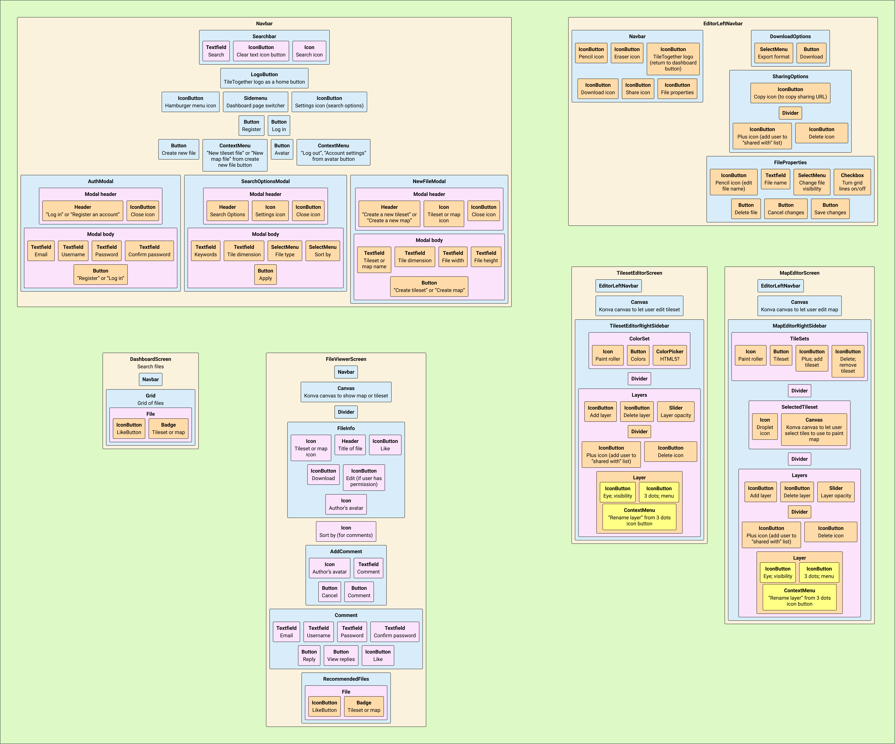
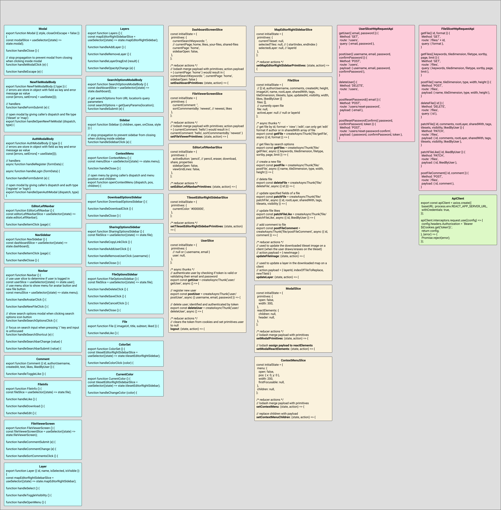

# TileTogether Static Assets

## Setup
1. Clone this repository
2. Run `npm install` in the root directory
3. Make sure TileTogether Service is running locally on port 3001
4. Run `npm run start` in the root directory
5. Go to `localhost:3000` and the React app should be running
6. Run `npm run test` to run tests

## Other notes
* The TileTogether Static Assets (React app) are deployed at http://tiletogether-static-assets-bucket.s3-website-us-east-1.
amazonaws.com/
* User Interface Mock Up: [UI Model.docs](https://docs.google.com/document/d/1p7Q9N7rTGxm3SRamcXo2fOoIK2IbtGlLoEpZQFlZiRc/edit?usp=sharing)

## Reference Documents
|  |
|:--:|
| <b>Front Component Model</b>|

|  |
|:--:|
| <b>Front End UML Model</b>|

